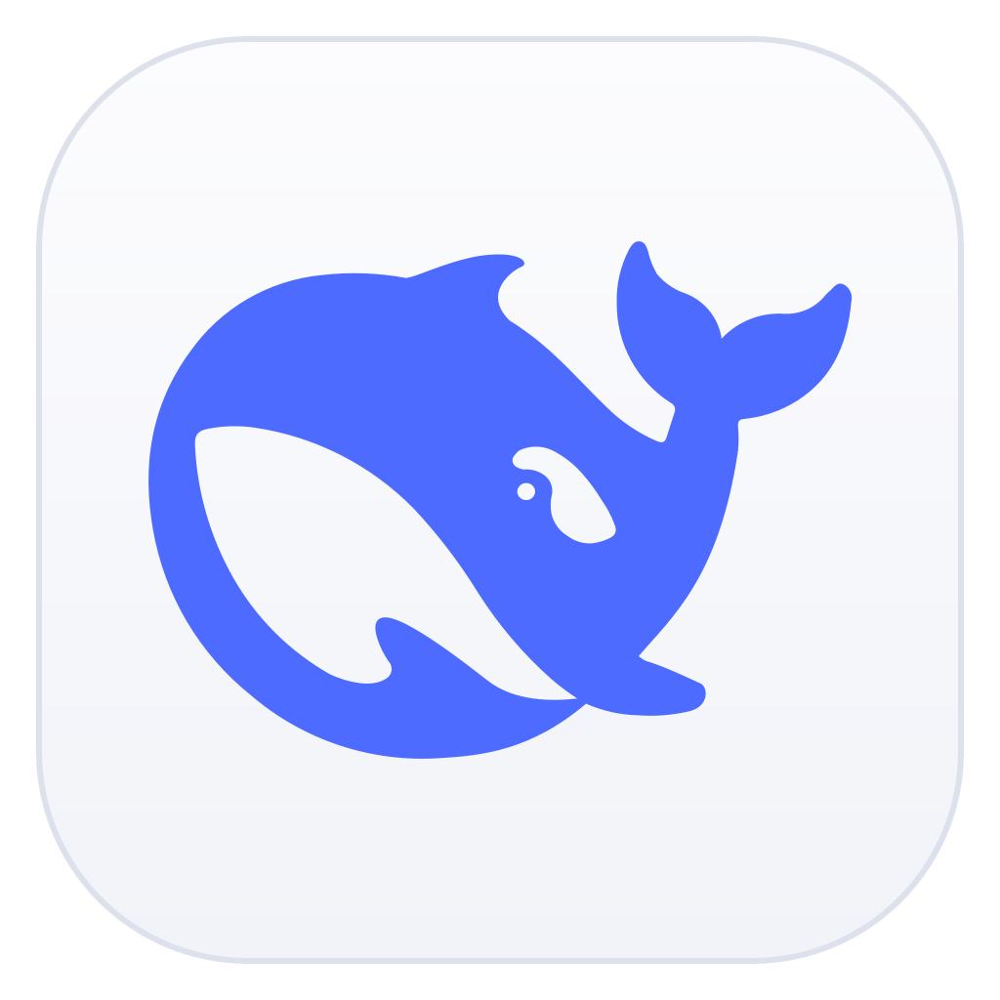

<div align="center">

# Deepseek Science



**本地优先的科研 AI 工作台 · DeepSeek 原生**

让 DeepSeek 系列模型成为你的科研助手：文献检索、代码实验、论文写作、PDF 编译——一个窗口里完成，数据留在本机。

Rust · React · Tauri 2 · 从零构建

</div>

---

## ✨ 特性

| | |
|---|---|
| **科研原生工具链** | 20+ 内置工具：`python` / `bash` 执行、`search_papers` / `fetch_paper`（OpenAlex）、`web_search` / `fetch_url`、`compile_pdf`（Tectonic）、文件/记忆/plan/skills 工具 |
| **可控思考模式** | 设置页可开关 Think、选择低/高/最大思考深度并限制 Agent 最大轮次；受支持的 DeepSeek/OpenAI 请求会携带对应推理字段，`reasoning_content` 实时流式呈现且可折叠；保留前缀缓存感知，同会话缓存命中率实测 **98%+** |
| **论文写作编排** | 内置 paper-writing skill：clarify → 文献综述 → 结构 → 图表 → 实验设计 → 同行评审 → 编译成 PDF |
| **长上下文不爆 token** | Rolling Compact：append-only 历史 + 非破坏性 projection，先免费裁剪工具输出、超阈值才付费摘要折叠 |
| **分层记忆** | 跨项目 profile + 项目级记忆，BM25 召回（CJK 感知），LLM 抽取，后台异步更新 |
| **计划与审查** | Plan 模式（生成计划 → 人工批准 → 执行）+ terminal barrier 最终审查（veto 可修一轮） |
| **可扩展** | MCP 客户端（streamable HTTP，动态挂载）+ A2A 协议（跨 agent 互操作）+ skill 体系（5 源加载） |
| **本地优先** | 后端 + 前端 + 桌面壳全部自包含，SQLite 落库（WAL），会话重启可恢复；浏览器仅做 UI 壳 |

---

## 🚀 快速开始

**环境要求**：Rust stable（edition 2021）· bun 1.3+ · （可选）Tectonic（`compile_pdf` 用）

API Key 通过环境变量注入（或应用内设置）：

```sh
export DEEPSEEK_API_KEY=sk-...
```

### 方式 A：桌面应用（推荐）

```sh
cd src-tauri && cargo tauri build
# 产物：src-tauri/target/release/bundle/macos/Deepseek Science.app
```

### 方式 B：本地开发（后端 + 前端）

```sh
# 终端 1：后端（默认端口 17896，提供 HTTP/SSE API）
cargo run -p dss-bin -- serve --port 17896

# 终端 2：前端（http://localhost:5173，/api 已代理到 17896）
cd frontend && bun install && bun run dev
```

浏览器打开 <http://localhost:5173> 即可使用完整功能。

### 方式 C：纯 API

```sh
curl -X POST http://127.0.0.1:17896/api/sessions          # 建会话
curl -N -X POST http://127.0.0.1:17896/api/sessions/<sid>/stream-sse \
  -H 'Content-Type: application/json' \
  -d '{"run_id":"r1","prompt":"用一句话说明质数有无穷多个"}'
# 响应含 complete.usage：{input_tokens, output_tokens, cache_hit_tokens, cache_miss_tokens}
```

---

## 🧪 测试

```sh
cargo test        # 300+ 测试：agent 门控、Rolling Compact、记忆 BM25、MCP、skills、缓存解析…
bun run build     # 前端类型检查 + 生产构建
```

> 注：`sandbox` 相关 4 个用例依赖 macOS `sandbox-exec` 权限，无沙箱权限的环境会跳过失败，非代码问题。

---

## 📚 文档

| 想了解什么 | 读这里 |
|---|---|
| 项目概览、产品边界 | [overview](docs/overview.md) |
| 整体架构、进程模型 | [architecture](docs/architecture.md) |
| 模块详细设计（agent/tools/skills/mcp/memory/compact/verify） | [modules](docs/modules.md) |
| HTTP/SSE API 契约 | [api-contract](docs/api-contract.md) |
| A2A Agent 接入指南 | [a2a-agent-implementation-guide](docs/a2a-agent-implementation-guide.md) |
| 数据模型与存储 | [data-model](docs/data-model.md) |
| 开发路线图与决策记录 | [roadmap](docs/roadmap.md) · [decisions](docs/decisions.md) |
| 前缀缓存省 token 方案（独立文档） | [research/prefix-cache-strategy](docs/research/prefix-cache-strategy.md) |

---

## 🗺️ 状态

- **核心主线已完成**：P0–P8 + F2（对话、工具、持久化、Rolling Compact、记忆、skills、plan/verify、MCP、A2A、日志、Tauri 桌面壳）。
- **增强方向**（P9+，待排期）：沙箱化执行、文献知识库、长程自主研究、学科插件。

## 🛠️ 技术栈

- **后端**：Rust · axum（HTTP/SSE）· SQLite（deadpool 连接池 + WAL）
- **前端**：React 18 · TypeScript · Vite · Tailwind（DeepSeek 设计语言：蓝 #4D6BFE / 1px 细边 / 简约）
- **桌面**：Tauri 2（内嵌后端进程托管：找端口 → spawn → 注入 → 关窗清理）
- **模型**：DeepSeek 系列（v4 思考模式），OpenAI 兼容协议，可配置其它端点

---

## 🤝 贡献

项目尚处早期，欢迎任何形式的参与。请先阅读 [贡献约定（HANDOFF）](HANDOFF.md) 与 [决策记录](docs/decisions.md)，遵守「最小改动、文档先行、每阶段可验收」的工作规则。

## 📄 License

暂未指定（详见仓库根目录 / 项目维护者）。商业与二次分发前请先联系。
