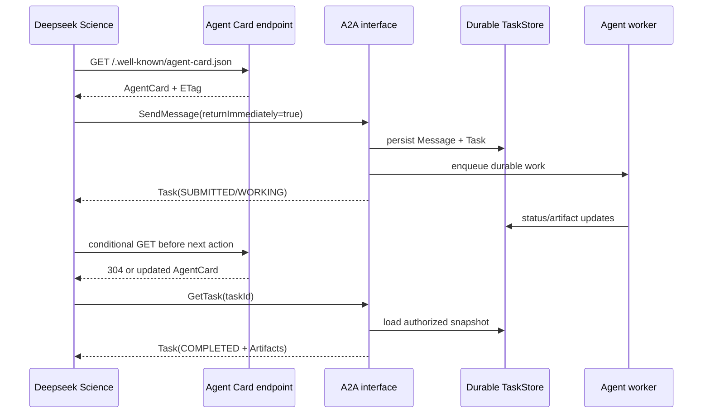
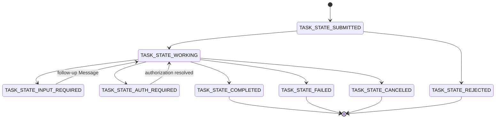

# 被 Deepseek Science 调用的 A2A Agent 实现说明

> **本文回答**：第三方 Agent 应如何实现 A2A 服务端，才能被 Deepseek Science 自动发现、调用、展示结果，并在长任务和 App 重启后继续查询？

> 状态：已定（A2A v1.0；2026-08-05 按 v1.0.1 规范、官方 Python SDK 和当前客户端实现复核）

---

## 1. 结论先行

新 Agent 推荐实现以下最小生产契约：

1. 使用 **A2A v1.0**。`v1.0.1` 是规范补丁版本，线协议和 Agent Card 中仍写 `1.0`，不能写 `1.0.1`。
2. 在 `GET /.well-known/agent-card.json` 发布合法 Agent Card。
3. 优先暴露 **JSON-RPC** interface，并实现 `SendMessage`、`GetTask`、`CancelTask`。
4. 短操作可以直接返回 `Message`；科研、检索、仿真等可追踪操作应返回 `Task`。
5. 长任务收到 `returnImmediately: true` 后立即返回 `SUBMITTED` 或 `WORKING` Task，后台继续执行。
6. Task、Message 和 Artifact 必须持久化；服务重启或滚动升级后，旧 `taskId` 仍能被 `GetTask` 查询。
7. Task 的正式结果放在 `Artifact.parts`；进度或补充输入请求放在 `TaskStatus.message`。
8. 不要返回内部思维链。A2A 标准没有 `thinking`、`plan` 或内部 `tool_call` 字段。
9. 生产使用 HTTPS；若需要鉴权，当前 Deepseek Science 客户端支持无认证或 HTTP Bearer。

只实现“LLM 收到文本后同步返回一段文字”也可以接入，但这只是 Message-only Agent，无法提供可靠的长任务恢复、取消和科研过程追踪。

## 2. 兼容范围

### 2.1 Deepseek Science 当前支持什么

| 能力 | 当前支持 | 说明 |
|---|---:|---|
| A2A v1.0 JSON-RPC | 是，推荐 | 最简单、测试最充分 |
| A2A v1.0 HTTP+JSON | 是 | 使用 `application/a2a+json` |
| A2A v0.3 | 兼容 | 只为旧 Agent；新实现不要优先选择 |
| `SendMessage` | 是 | 新建或续接 Task |
| `GetTask` | 是 | 查询或恢复长任务 |
| `CancelTask` | 是 | 请求取消一次，不持续轮询 |
| `SendStreamingMessage` / `SubscribeToTask` | 否 | 当前客户端使用 polling |
| Push Notification | 否 | 当前客户端不注册 webhook |
| gRPC | 否 | Card 中即使声明也不会被选择 |
| Bearer 鉴权 | 是 | 同一个 token 用于 Card 和调用接口 |
| 其他鉴权 | 否 | OAuth 登录流程、API key query、mTLS 等尚未接入 |

Deepseek Science 是 A2A **client**，不会暴露入站 A2A server。配置的每个远端 Agent 会进入本地 harness，成为一个可供主 Agent 选择的动态工具。

### 2.2 标准与本项目约定的边界

- `SendMessage`、`GetTask`、`CancelTask`、Agent Card、Task、Artifact 都是 A2A 标准。
- Deepseek Science 工具参数中的 `send`、`submit`、`get_task`、`cancel_task` 是本地调用动作。
- `submit` **不是**远端 A2A 方法。它仍调用标准 `SendMessage`，只是收到非终态 Task 后立即保存句柄并返回。
- `dss.a2a.tool-result.v1` 是 Deepseek Science 用于 UI 和 SQLite 的本地 envelope，永远不会发给远端 Agent。
- 请求 Message 中可选的 `metadata.skillId` 是本客户端提供的路由提示；服务端不应把它当作唯一授权依据。

这里定义的是“可被 Deepseek Science 调用”的互操作最小集，不等同于完整 A2A conformance profile。若服务对外宣称完整实现 A2A v1，还应按规范实现 `ListTasks`，并让 streaming、push、extended card 等可选操作与 Card 中声明的 capabilities 严格一致。

### 2.3 当前客户端硬限制

| 项目 | 上限或行为 |
|---|---|
| Agent Card | 256 KiB |
| 单个完整响应 | 1 MiB |
| 一次本地调用的全部响应 | 累计 4 MiB |
| `task` 输入文本 | 256 KiB |
| `skillId/taskId/contextId` | 各 512 bytes，不能含控制字符 |
| 单次工具超时 | 用户配置 5–300 秒，默认 120 秒 |
| `send/get_task` polling | 250 ms 指数退避到 2 s，最多 128 次且受总超时约束 |
| Card interface `tenant` | 2,048 bytes，原样回传 |

这些是 Deepseek Science 的防护边界，不取代服务端自己的限流、配额和任务保留策略。

## 3. 一次完整调用



这里有两个容易忽略的要求：

- Deepseek Science 在**每次**调用前都会刷新 Card。Card 服务是长任务控制面的一部分，不能只在首次接入时可用。
- 如果 Card 更新了 interface URL，新 interface 仍必须能查询旧 Task；否则 App 虽然恢复了 `taskId`，也恢复不了远端任务。

## 4. Agent Card

### 4.1 发现地址

服务端必须提供：

```text
GET https://agent.example.com/.well-known/agent-card.json
Accept: application/json
Cache-Control: no-cache
```

在设置中建议填写 origin，例如 `https://agent.example.com`。除非填写的就是标准 well-known URL，Deepseek Science 会丢弃配置 URL 的 path/query，并到同 origin 根路径获取 Card。

Card endpoint 应：

- 返回 HTTP 200 和 JSON；
- 支持 `ETag`，最好同时支持 `Last-Modified`；
- 对 `If-None-Match` / `If-Modified-Since` 返回 304；
- 不依赖重定向；Deepseek Science 禁止 Card 和调用接口重定向；
- 保持在 256 KiB 以内；
- Card 可以公开；若 Card endpoint 本身受保护，则必须接受与调用接口相同的 Bearer。

### 4.2 最小可用 Card

```json
{
  "name": "Fast Reactor Research Agent",
  "description": "Performs evidence-oriented fast-reactor research and returns auditable reports.",
  "supportedInterfaces": [
    {
      "url": "https://agent.example.com/a2a",
      "protocolBinding": "JSONRPC",
      "protocolVersion": "1.0"
    }
  ],
  "version": "1.2.0",
  "capabilities": {
    "streaming": false,
    "pushNotifications": false,
    "extendedAgentCard": false
  },
  "securitySchemes": {},
  "securityRequirements": [],
  "defaultInputModes": ["text/plain"],
  "defaultOutputModes": ["text/markdown", "application/json"],
  "skills": [
    {
      "id": "fast-reactor-research",
      "name": "Fast-reactor research",
      "description": "Reviews evidence, compares reactor concepts, and proposes testable AI-accelerated research tasks.",
      "tags": ["nuclear-engineering", "generation-iv", "fast-reactor", "research"],
      "examples": [
        "Review recent Generation-IV fast-reactor progress and identify AI research opportunities."
      ],
      "inputModes": ["text/plain"],
      "outputModes": ["text/markdown", "application/json"]
    }
  ]
}
```

v1 Card 必填字段如下；标为数组的必填字段应至少有一项。

| 字段 | 要求 |
|---|---|
| `name` | 非空人类可读名称 |
| `description` | 清楚说明边界、输入和产出，不要写提示注入式指令 |
| `supportedInterfaces[]` | 按偏好顺序列出 interface；第一项最优先 |
| `supportedInterfaces[].url` | 绝对 URL；生产使用 HTTPS；当前须与 Card 同 scheme/host/port |
| `supportedInterfaces[].protocolBinding` | 推荐 `JSONRPC`；也可用 `HTTP+JSON` |
| `supportedInterfaces[].protocolVersion` | 固定写 `1.0` |
| `version` | Agent 自身版本，不是协议版本 |
| `capabilities` | 对象；只声明实际实现的可选能力 |
| `defaultInputModes[]` | 与当前客户端互操作时必须接受 `text/plain`；客户端始终发送 text Part |
| `defaultOutputModes[]` | 至少与 `text/plain`、`text/markdown`、`application/json` 之一相交 |
| `skills[]` | 每项至少有 `id/name/description/tags` |

不要把 v0.3 字段混进 v1 Card。v1 已移除顶层 `url`、`protocolVersion`、`preferredTransport` 和 `additionalInterfaces`；协议版本只属于每个 `supportedInterfaces[]` 项。

### 4.3 Bearer Card 示例

如接口要求 Bearer，在 Card 中声明标准 HTTP auth scheme：

```json
{
  "securitySchemes": {
    "bearerAuth": {
      "httpAuthSecurityScheme": {
        "scheme": "Bearer",
        "bearerFormat": "JWT"
      }
    }
  },
  "securityRequirements": [
    {
      "schemes": {
        "bearerAuth": {
          "list": []
        }
      }
    }
  ]
}
```

这些字段应合并到完整 Card，不能代替其余必填字段。Card 只描述认证方式，**绝不能包含 token、API key 或内部凭据**。

当前客户端只支持无认证或 Bearer。如果 Card 的所有可选认证分支都要求 OAuth、mTLS、Basic 或 query API key，Card 会被判为不可用。

### 4.4 Extension 限制

Deepseek Science 当前不发送 `A2A-Extensions`，也不对任何 A2A Extension 做语义协商或专用渲染。因此：

- optional extension 可以声明 `required: false`，但服务端不能假定本客户端已选择它；
- 不要声明 `required: true`，否则 Card 会被拒绝；
- 不要用私有顶层字段冒充标准能力。

当前要让用户看见执行过程，应优先使用标准 `TaskStatus.message`，并把需要恢复的过程产物写入 Artifact。若未来双方明确协商执行 trace，再定义带 URI 和版本的正式 Extension，在 Card 的 `capabilities.extensions` 中声明，并在 Message/Artifact 的 `extensions` 与 `metadata` 中引用；未协商的扩展目前最多只会出现在完整原始 JSON 中。无论是否使用 Extension，都不应传输隐藏思维链或凭据。

## 5. JSON-RPC v1 接口

### 5.1 通用 HTTP 契约

Card interface 假设为 `https://agent.example.com/a2a`。所有 JSON-RPC 调用都 POST 到这个 URL：

```text
POST /a2a
Content-Type: application/json
Accept: application/json
A2A-Version: 1.0
Authorization: Bearer <token>   # 仅配置时存在
```

服务端必须：

- 校验 `A2A-Version: 1.0`；
- 接受 JSON-RPC 2.0；
- 原样回显请求 `id`，包括其 JSON 类型；
- 使用 v1 PascalCase 方法名；
- 在认证和 Task 所有权校验通过后才访问或返回任务数据；
- 对未知字段保持前向兼容，但不能忽略必填字段或非法 oneof。

### 5.2 `SendMessage`

Deepseek Science 发送的新任务请求形如：

```json
{
  "jsonrpc": "2.0",
  "id": "2c72896c-dff7-4ae8-a55c-4e5b4945d345",
  "method": "SendMessage",
  "params": {
    "message": {
      "messageId": "48a52b41-c8f6-4cd0-b751-eef1a67dcb10",
      "role": "ROLE_USER",
      "parts": [
        {
          "text": "调研四代快堆的最新进展，并提出可由 AI 加速的研究课题。"
        }
      ],
      "metadata": {
        "skillId": "fast-reactor-research"
      }
    },
    "configuration": {
      "acceptedOutputModes": ["text/markdown", "application/json"],
      "historyLength": 50,
      "returnImmediately": true
    }
  }
}
```

如果 Card interface 含 `tenant`，JSON-RPC 请求还会在 `params.tenant` 原样携带该值。

`SendMessage` 的 `result` 必须是 `SendMessageResponse` union wrapper，恰好含一个 `task` 或一个 `message`。

长任务响应：

```json
{
  "jsonrpc": "2.0",
  "id": "2c72896c-dff7-4ae8-a55c-4e5b4945d345",
  "result": {
    "task": {
      "id": "task-b4b958c3",
      "contextId": "ctx-c0d21ea2",
      "status": {
        "state": "TASK_STATE_WORKING",
        "timestamp": "2026-08-05T12:00:00Z",
        "message": {
          "messageId": "msg-progress-1",
          "contextId": "ctx-c0d21ea2",
          "taskId": "task-b4b958c3",
          "role": "ROLE_AGENT",
          "parts": [
            {
              "text": "正在检索与交叉核验资料。",
              "mediaType": "text/plain"
            }
          ]
        }
      },
      "artifacts": [],
      "history": []
    }
  }
}
```

立即完成的无状态响应：

```json
{
  "jsonrpc": "2.0",
  "id": "2c72896c-dff7-4ae8-a55c-4e5b4945d345",
  "result": {
    "message": {
      "messageId": "msg-answer-1",
      "contextId": "ctx-c0d21ea2",
      "role": "ROLE_AGENT",
      "parts": [
        {
          "text": "快速参数校验已完成：请求格式有效。",
          "mediaType": "text/plain"
        }
      ]
    }
  }
}
```

不要直接把裸 Task 放在 `SendMessage.result`：

```json
{
  "jsonrpc": "2.0",
  "id": "request-id",
  "result": {
    "id": "task-id",
    "status": {
      "state": "TASK_STATE_WORKING"
    }
  }
}
```

上面的形状是错误的；它缺少 `result.task` wrapper。

### 5.3 `GetTask`

请求：

```json
{
  "jsonrpc": "2.0",
  "id": "get-1",
  "method": "GetTask",
  "params": {
    "id": "task-b4b958c3",
    "historyLength": 50
  }
}
```

与 `SendMessage` 不同，`GetTask.result` 是**裸 Task**：

```json
{
  "jsonrpc": "2.0",
  "id": "get-1",
  "result": {
    "id": "task-b4b958c3",
    "contextId": "ctx-c0d21ea2",
    "status": {
      "state": "TASK_STATE_COMPLETED",
      "timestamp": "2026-08-05T12:04:30Z"
    },
    "artifacts": [
      {
        "artifactId": "report-1",
        "name": "fast-reactor-report",
        "description": "Evidence-oriented research report and machine-readable audit data.",
        "parts": [
          {
            "text": "# 四代快堆研究报告\n\n## 结论\n\n……",
            "mediaType": "text/markdown",
            "filename": "report.md"
          },
          {
            "data": {
              "confidence": 0.82,
              "sourceCount": 37,
              "limitations": ["公开数据时效性", "部分设计资料不可获取"]
            },
            "mediaType": "application/json",
            "filename": "audit.json"
          }
        ]
      }
    ],
    "history": []
  }
}
```

Deepseek Science 可能反复调用 `GetTask`。此操作必须无副作用，并返回一个自洽的当前快照。运行中的快照应尽量小；把完整 artifacts/history 放在完成快照，可避免重复轮询累计超过客户端响应上限。

### 5.4 `CancelTask`

请求：

```json
{
  "jsonrpc": "2.0",
  "id": "cancel-1",
  "method": "CancelTask",
  "params": {
    "id": "task-b4b958c3"
  }
}
```

成功响应同样返回裸 Task：

```json
{
  "jsonrpc": "2.0",
  "id": "cancel-1",
  "result": {
    "id": "task-b4b958c3",
    "contextId": "ctx-c0d21ea2",
    "status": {
      "state": "TASK_STATE_CANCELED",
      "timestamp": "2026-08-05T12:01:00Z"
    }
  }
}
```

取消应是幂等意图：重复取消不会重新运行任务。若任务已到不可取消的终态，返回标准 `TaskNotCancelableError`，不要伪造 `CANCELED`。

## 6. HTTP+JSON v1 接口

若 Card 选择 `HTTP+JSON`，Deepseek Science 使用：

| 操作 | 相对 interface URL | Body / query |
|---|---|---|
| Send | `POST message:send` | `SendMessageRequest` JSON |
| Get | `GET tasks/{taskId}?historyLength=50` | 无 body |
| Cancel | `POST tasks/{taskId}:cancel` | 无 body |

请求和响应 media type 为 `application/a2a+json`。Send 响应仍是 `{"task": ...}` 或 `{"message": ...}` wrapper；Get/Cancel 响应仍是裸 Task。

如果 interface 是 `https://agent.example.com/a2a`，实际 Send URL 是 `https://agent.example.com/a2a/message:send`。如果 Card interface 还声明 `tenant: "lab-a"`，路径变为 `https://agent.example.com/a2a/lab-a/message:send`；tenant 不再放进 body。

## 7. Message、Part 和 Artifact

### 7.1 v1 JSON 形状

v1 使用 ProtoJSON camelCase：

- 角色：`ROLE_USER`、`ROLE_AGENT`；
- 状态：完整的 `TASK_STATE_*`；
- Message 必填：`messageId`、`role`、非空 `parts`；
- Agent 发出的 Message 必须带 `contextId`；若已创建 Task，还应带 `taskId`；
- Part 的内容 oneof 直接是 `text`、`raw`、`url` 或 `data` 中的一种；
- Part 可附 `mediaType`、`filename`、`metadata`；
- Artifact 必填 `artifactId` 和非空 `parts`。

以下是 v0.3 风格，**不能**用于 v1：

```json
{
  "kind": "text",
  "text": "..."
}
```

```json
{
  "kind": "file",
  "file": {
    "uri": "https://example.com/report.pdf"
  }
}
```

v1 应写成：

```json
{
  "text": "...",
  "mediaType": "text/markdown"
}
```

```json
{
  "url": "https://example.com/report.pdf",
  "mediaType": "application/pdf",
  "filename": "report.pdf"
}
```

### 7.2 科研结果怎么组织

推荐一个 Artifact 同时提供：

- `text/markdown`：给人和主 Agent 阅读的完整报告；
- `application/json`：来源、参数、统计量、假设、置信度、失败条件等机器可读数据；
- `url` Part：大型数据集、图像或 PDF 的 HTTPS 地址；
- `metadata`：schema 版本、生成时间、数据 lineage、哈希等。

Markdown 可使用标题、粗体、列表、引用、表格、删除线、代码块、数学公式和 emoji。Deepseek Science 会安全渲染文本内容，但不会执行 HTML，也不会自动抓取 URL Part。

正式结果不要只放在 `TaskStatus.message`。状态消息可能是瞬时信息；可恢复结果应进入 Task 的 Artifacts，并在后续 `GetTask` 快照里出现。

### 7.3 大文件

当前限制为：单个响应 1 MiB，单次调用接收的全部响应累计 4 MiB。大文件建议返回：

1. 小型 Markdown 摘要；
2. HTTPS URL；
3. `sha256`、字节数、media type；
4. 访问期限和所需认证说明。

不要为每个 `WORKING` 快照重复返回完整报告，否则轮询几次就可能触发累计上限。

## 8. 长任务状态机

下面是典型路径，不是协议允许状态转移的穷尽图。



| 状态 | 类型 | Deepseek Science 行为 |
|---|---|---|
| `TASK_STATE_UNSPECIFIED` | 进行中但不推荐 | 继续查询 |
| `TASK_STATE_SUBMITTED` | 进行中 | 继续查询或保存句柄 |
| `TASK_STATE_WORKING` | 进行中 | 继续查询或保存句柄 |
| `TASK_STATE_INPUT_REQUIRED` | 可恢复中断 | 保存 `taskId/contextId`，等待补充输入 |
| `TASK_STATE_AUTH_REQUIRED` | 可恢复中断 | 保存句柄，等待带外授权 |
| `TASK_STATE_COMPLETED` | 成功终态 | 展示 Artifacts |
| `TASK_STATE_FAILED` | 失败终态 | 展示失败和最后快照 |
| `TASK_STATE_CANCELED` | 失败终态 | 标记已取消 |
| `TASK_STATE_REJECTED` | 失败终态 | 标记拒绝执行 |

实现规则：

- 新 Task 的 `id` 由服务端生成，必须在服务端全局或租户范围内唯一；
- `contextId` 用于关联同一研究上下文中的多个 Message/Task；
- 同一 Task 的所有响应都保持相同 `id` 和 `contextId`；
- terminal Task 不再接受 follow-up Message；
- `INPUT_REQUIRED` / `AUTH_REQUIRED` 不是失败，也不是 terminal；
- 需要补充输入时，在 `TaskStatus.message` 中用清楚的自然语言描述缺什么；
- 凭据默认使用带外安全通道提供，不要要求把 token 作为普通 Message 文本发送。

### 8.1 续接同一 Task

用户补充输入后，Deepseek Science 会再次调用 `SendMessage`，Message 带上已有句柄：

```json
{
  "messageId": "follow-up-message-id",
  "taskId": "task-b4b958c3",
  "contextId": "ctx-c0d21ea2",
  "role": "ROLE_USER",
  "parts": [
    {
      "text": "把时间范围限定为 2024 至 2026 年，并优先比较 SFR 与 LFR。"
    }
  ]
}
```

服务端应续接这个 Task，而不是创建新 Task；响应中的 `taskId/contextId` 不能变化。若请求同时携带二者但关系不匹配，应返回协议错误。

## 9. 持久化、队列和幂等

### 9.1 最低持久化模型

生产服务至少保存：

- Task：`id`、`context_id`、owner/tenant、当前状态、时间戳、metadata；
- Message：`message_id`、Task/Context 关联、role、parts、接收顺序；
- Artifact：`artifact_id`、Task 关联、parts、版本或 append 状态；
- 去重记录：调用者范围内的 `message_id` 及对应响应/Task；
- 作业记录：队列 ID、lease、重试次数、取消标记、worker heartbeat；
- 鉴权范围：谁可以 Get/Cancel/续接哪个 Task。

推荐流程：

1. 在一个数据库事务中校验请求、按 `messageId` 去重、写入 Message 和初始 Task；
2. 提交事务后再发布 durable queue job，或使用 transactional outbox；
3. worker 以 lease/heartbeat 领取任务；
4. 状态与 Artifact 更新原子写入；
5. API 始终从 TaskStore 返回一致快照；
6. 服务重启时恢复未终态任务，不丢失已返回给客户端的 Task handle。

仓库示例使用 `InMemoryTaskStore`，只适合 E2E。生产环境不能照抄，否则 Agent 重启后 Deepseek Science 保存的 `taskId` 全部失效。

持久 TaskStore 只解决“快照还在”，不等于后台作业能恢复。worker 的队列、lease、检查点和取消信号也必须持久化或可重建。服务端还应公开 Task/Artifact 的保留期限：不要清理非终态 Task；终态保留期应覆盖实际科研工作流，例如按组织策略保留 30 天或更久。过期后返回标准 `TaskNotFoundError`，并避免留下仍可访问但无法审计的半残 Artifact。

### 9.2 幂等与竞争条件

- `GetTask` 天然幂等，不能推进工作或重复产生 Artifact；
- `CancelTask` 应表现为幂等意图；
- A2A 只规定 `SendMessage` **可以**幂等，不保证客户端重试；服务端仍应以 `messageId` 去重；
- 同一 `messageId` 重放时返回原 Task/Message，不再创建作业；
- Cancel 与 Complete 竞争时，以数据库中的首次合法终态为准；终态不可回退；
- worker 重试不得重复追加同一 Artifact chunk；用稳定 artifact/chunk ID 或版本号去重；
- 任何网络超时都可能意味着“请求已到达但响应丢失”，所以副作用必须可审计。

## 10. 错误处理

JSON-RPC 错误形状：

```json
{
  "jsonrpc": "2.0",
  "id": "get-1",
  "error": {
    "code": -32001,
    "message": "Task not found or not accessible"
  }
}
```

对一个已经进入 JSON-RPC 处理层的合法 HTTP 请求，A2A/业务错误应使用 **HTTP 2xx + JSON-RPC `error` envelope**，这样 Deepseek Science 才能保留并解析标准错误；认证失败等 HTTP 层错误仍可使用 401/403。下表的 4xx/5xx 状态映射用于 HTTP+JSON binding。当前客户端会在解析 JSON-RPC envelope 前拒绝非 2xx，因此不要对 JSON-RPC 的 `TaskNotFoundError` 直接返回 HTTP 404。

常用 A2A v1 错误：

| 错误 | JSON-RPC code | HTTP+JSON status | 何时使用 |
|---|---:|---:|---|
| `TaskNotFoundError` | `-32001` | 404 | Task 不存在或调用者不可访问 |
| `TaskNotCancelableError` | `-32002` | 400 | 已终态或当前不可取消 |
| `PushNotificationNotSupportedError` | `-32003` | 400 | 未支持 push 却收到相关请求 |
| `UnsupportedOperationError` | `-32004` | 400 | 未声明或未实现的可选操作 |
| `ContentTypeNotSupportedError` | `-32005` | 400 | Part media type 不支持 |
| `InvalidAgentResponseError` | `-32006` | 500 | Agent 内部产生了不合法响应 |
| `ExtendedAgentCardNotConfiguredError` | `-32007` | 400 | 声明 extended card 却未配置 |
| `ExtensionSupportRequiredError` | `-32008` | 400 | required extension 未协商 |
| `VersionNotSupportedError` | `-32009` | 400 | `A2A-Version` 不支持 |

服务端错误信息应可操作但不泄露：

- 不返回堆栈、prompt、内部路径、数据库键或凭据；
- 对无权访问的 Task 使用与不存在相同的外部语义；
- HTTP+JSON 输入问题使用 4xx；JSON-RPC 输入/A2A 问题使用 2xx error envelope；内部执行失败将 Task 转为 `FAILED` 并给稳定错误码；
- 不要把失败包装成 HTTP 200 的普通 Agent Message。

优先使用官方 SDK 生成错误；手写时还需遵守 JSON-RPC 或 `google.rpc.Status` 的标准 details 形状。

## 11. 安全要求

### 11.1 网络与鉴权

- 生产只使用 HTTPS，禁用明文 token；
- 每个请求先认证，再按 caller/tenant 对 Task 做授权；
- Send、Get、Cancel 的认证和授权策略保持一致；公共 Card 可以不鉴权，但必须准确声明操作接口的认证要求；
- token 不进日志、trace、Task metadata、Artifact 或错误；
- token 轮换不能破坏对旧 Task 的授权语义；
- 对 Card 和 API 做 rate limit、body limit、header limit 和超时。

### 11.2 Agent 执行安全

- 把 Message、Card metadata、URL 和远端文件都当作不可信输入；
- Agent 若能执行代码/命令，必须在沙箱中限制文件、网络、CPU、内存和时间；
- 工具权限按 skill 最小化，不因自然语言请求自动扩大；
- 对外部检索结果做 prompt-injection 隔离；
- 正式科研结论记录来源、时间、假设、版本和不确定性；
- 禁止把隐藏 reasoning、系统提示、内部工具参数和供应商凭据放入 A2A 返回。

### 11.3 URL、文件和 webhook

- URL Part 只返回 `https://` 或明确允许的 scheme；
- Deepseek Science 不自动抓取 URL Part，也不会把 A2A Bearer 转发给这些 URL；受保护的大文件应使用短期签名 URL 或另行声明下载认证流程；
- 若服务端会抓取用户 URL，防 DNS rebinding、私网地址、云 metadata 和重定向 SSRF；
- 文件下载设置大小、类型、解压比和恶意内容检查；
- 若未来实现 push，webhook URL 也必须做 SSRF 防护，使用至少一次投递语义和幂等事件 ID。

## 12. 使用官方 Python SDK 实现

建议使用官方 SDK，而不是手写 ProtoJSON 和错误映射：

```bash
pip install "a2a-sdk[http-server]==1.1.2"
```

`1.1.2` 是本仓库已完成互操作测试的 SDK 版本。升级时应显式修改 lockfile，并重跑本章验收矩阵。

服务端结构应包含四部分：

1. `AgentCard`：声明 v1 interface、skills、media type 和安全要求；
2. `AgentExecutor`：实现 `execute()` 与 `cancel()`；
3. `TaskStore`：开发可内存，生产必须持久；
4. HTTP routes：标准 Card route 和 JSON-RPC `/a2a` route。

下面是删减后的结构示意，异常、鉴权、持久队列和关停逻辑仍需补齐：

```python
from a2a.server.agent_execution.agent_executor import AgentExecutor
from a2a.server.agent_execution.context import RequestContext
from a2a.server.events.event_queue import EventQueue
from a2a.server.request_handlers import DefaultRequestHandler
from a2a.server.routes import create_agent_card_routes, create_jsonrpc_routes
from a2a.server.tasks.task_updater import TaskUpdater
from a2a.types import (
    AgentCapabilities,
    AgentCard,
    AgentInterface,
    AgentSkill,
    Part,
    Task,
    TaskState,
    TaskStatus,
)
from google.protobuf.json_format import ParseDict
from google.protobuf.struct_pb2 import Value


def to_proto_value(data: dict) -> Value:
    value = Value()
    ParseDict(data, value)
    return value


class ResearchExecutor(AgentExecutor):
    async def execute(self, context: RequestContext, queue: EventQueue) -> None:
        task_id = context.task_id
        context_id = context.context_id
        message = context.message
        if not task_id or not context_id or message is None:
            raise RuntimeError("SDK did not provide task/context/message")

        updater = TaskUpdater(
            event_queue=queue,
            task_id=task_id,
            context_id=context_id,
        )
        try:
            # For a new Task, publish a complete snapshot before status events. A follow-up
            # Message already names its Task, so the SDK/TaskStore supplies the existing snapshot.
            if not message.task_id:
                await queue.enqueue_event(
                    Task(
                        id=task_id,
                        context_id=context_id,
                        status=TaskStatus(state=TaskState.TASK_STATE_SUBMITTED),
                        history=[message],
                    )
                )

            await updater.start_work(
                message=updater.new_agent_message(
                    parts=[Part(text="Research started", media_type="text/plain")]
                )
            )

            # Run a durable/sandboxed job. In production this work must survive process restart.
            markdown, audit = await run_or_resume_durable_research(
                task_id,
                context.get_user_input(),
            )

            await updater.add_artifact(
                name="research-report",
                parts=[
                    Part(text=markdown, media_type="text/markdown", filename="report.md"),
                    Part(
                        data=to_proto_value(audit),
                        media_type="application/json",
                        filename="audit.json",
                    ),
                ],
                last_chunk=True,
            )
            await updater.complete()
        except Exception:
            await updater.failed(
                message=updater.new_agent_message(
                    parts=[Part(text="Research failed", media_type="text/plain")]
                )
            )

    async def cancel(self, context: RequestContext, queue: EventQueue) -> None:
        task_id = context.task_id
        context_id = context.context_id
        if not task_id or not context_id:
            raise RuntimeError("SDK did not provide task/context")

        await cancel_durable_job(task_id)
        updater = TaskUpdater(
            event_queue=queue,
            task_id=task_id,
            context_id=context_id,
        )
        await updater.cancel()


card = AgentCard(
    name="Research Agent",
    description="Produces evidence-oriented research reports.",
    version="1.0.0",
    capabilities=AgentCapabilities(streaming=False, push_notifications=False),
    default_input_modes=["text/plain"],
    default_output_modes=["text/markdown", "application/json"],
    supported_interfaces=[
        AgentInterface(
            url="https://agent.example.com/a2a",
            protocol_binding="JSONRPC",
            protocol_version="1.0",
        )
    ],
    skills=[
        AgentSkill(
            id="research",
            name="Research",
            description="Performs bounded research and returns an auditable report.",
            tags=["research", "science"],
        )
    ],
)

handler = DefaultRequestHandler(
    agent_executor=ResearchExecutor(),
    task_store=production_task_store,
    agent_card=card,
)

routes = [
    *create_agent_card_routes(agent_card=card),
    *create_jsonrpc_routes(request_handler=handler, rpc_url="/a2a"),
]
```

ASGI 应在 lifespan/shutdown hook 中调用 `await handler.aclose()`，以关闭 SDK 后台任务；在收到进程终止信号时，还要把 worker lease 安全交还队列。上面的 `except` 故意只返回稳定失败信息，不把内部异常或凭据暴露给远端。

SDK 版本的具体构造参数可能演进，应锁定依赖并以对应 SDK 文档为准。仓库中的 [`scripts/a2a_real_agent_server.py`](../scripts/a2a_real_agent_server.py) 是已经与当前客户端做过真实调用、长 Task、Artifact 和取消测试的完整骨架，但它：

- 只监听 loopback；
- 使用 `InMemoryTaskStore`；
- 通过受限 helper 运行一次测试 LLM 调用；
- 是 E2E sidecar，不是可直接部署的生产服务。

## 13. 接入 Deepseek Science

1. 部署 Agent，并先在浏览器或 curl 验证 Card URL。
2. 在 Deepseek Science 设置页添加 A2A Agent。
3. Endpoint 填 origin，例如 `https://agent.example.com`。
4. 如 Card 要求 Bearer，填入 token；保存后 UI 只显示掩码。
5. 保存时确认状态为 ready，Card 摘要和 skills 正确。
6. 新建会话，让主 Agent 执行一个短任务和一个长任务。
7. 长任务先用 `submit`，记录返回的 `taskId/contextId`。
8. 退出并重开 App，从同一 session 恢复后执行 `get_task`。
9. 再创建一个运行中 Task，执行 `cancel_task`。

Endpoint、Card interface、证书和 DNS 在这一过程中必须保持稳定。修改 endpoint 时，Deepseek Science 不会把旧 endpoint 的 Bearer 自动转发到新地址。

## 14. 验收测试

### 14.1 Card

```bash
curl --fail-with-body \
  --header 'Accept: application/json' \
  https://agent.example.com/.well-known/agent-card.json
```

检查：

- 必填字段完整；
- interface 与 Card 同源；
- `protocolVersion` 是 `1.0`；
- `defaultOutputModes` 含 Markdown、JSON 或 plain text；
- required extension 为空；
- 无凭据和内部信息；
- ETag 条件 GET 返回 304。

### 14.2 发送

```bash
curl --fail-with-body https://agent.example.com/a2a \
  --header 'Content-Type: application/json' \
  --header 'Accept: application/json' \
  --header 'A2A-Version: 1.0' \
  --data '{
    "jsonrpc":"2.0",
    "id":"smoke-send-1",
    "method":"SendMessage",
    "params":{
      "message":{
        "messageId":"smoke-message-1",
        "role":"ROLE_USER",
        "parts":[{"text":"Return a short auditable research result."}]
      },
      "configuration":{
        "acceptedOutputModes":["text/markdown","application/json"],
        "historyLength":50,
        "returnImmediately":true
      }
    }
  }'
```

检查：响应 `id` 完全相同；`result` 恰有 `task` 或 `message`；长任务在短时间内返回句柄。

### 14.3 查询和取消

把 `${TASK_ID}` 替换为 Send 返回的 ID：

```bash
curl --fail-with-body https://agent.example.com/a2a \
  --header 'Content-Type: application/json' \
  --header 'Accept: application/json' \
  --header 'A2A-Version: 1.0' \
  --data '{"jsonrpc":"2.0","id":"smoke-get-1","method":"GetTask","params":{"id":"'"${TASK_ID}"'","historyLength":50}}'
```

```bash
curl --fail-with-body https://agent.example.com/a2a \
  --header 'Content-Type: application/json' \
  --header 'Accept: application/json' \
  --header 'A2A-Version: 1.0' \
  --data '{"jsonrpc":"2.0","id":"smoke-cancel-1","method":"CancelTask","params":{"id":"'"${TASK_ID}"'"}}'
```

### 14.4 必测矩阵

| 场景 | 预期 |
|---|---|
| 短 Message | `ROLE_AGENT` + 非空 parts |
| 长 Task submit | 快速返回 SUBMITTED/WORKING + 稳定 IDs |
| 多次 GetTask | 状态前进，IDs 不变，无副作用 |
| 完成 | COMPLETED + 非空 Artifact |
| App/服务重启 | 旧 taskId 仍可查询 |
| Cancel | 返回 CANCELED 或标准 NotCancelable |
| INPUT_REQUIRED | 保留 Task，follow-up 后继续同一 Task |
| AUTH_REQUIRED | 不在 Message 中索取明文凭据 |
| 重放 messageId | 不创建第二个 Task |
| Card 更新 | 旧 Task 在新 interface 仍可查询 |
| Bearer 缺失/错误 | 401/403，不泄露任务是否存在 |
| 非法 media type | ContentTypeNotSupportedError |
| 大响应 | 服务端主动分页/外链，不撞 1 MiB 上限 |
| 并发 Cancel/Complete | 只出现一个不可逆终态 |

建议再使用官方 [A2A Inspector](https://github.com/a2aproject/a2a-inspector) 做独立协议检查，然后用真实打包后的 Deepseek Science App 完成恢复和 UI 展示测试。

## 15. 上线检查清单

- [ ] Card 位于 `/.well-known/agent-card.json`，无需重定向
- [ ] wire protocol 写 `1.0`，不是 `1.0.1`
- [ ] Card v1 必填字段和 skills 完整
- [ ] 首选 interface 为同源 HTTPS JSON-RPC
- [ ] 实现 `SendMessage`、`GetTask`、`CancelTask`
- [ ] `SendMessage.result` 使用 `task/message` wrapper
- [ ] Get/Cancel 返回裸 Task
- [ ] v1 enum、camelCase 和 Part oneof 正确
- [ ] `returnImmediately: true` 不阻塞至任务完成
- [ ] TaskStore、队列和 Artifact 为持久化实现
- [ ] App 和 Agent 重启后旧 Task 可恢复
- [ ] `messageId` 去重，Get/Cancel 幂等
- [ ] IDs 在 Task 全生命周期稳定
- [ ] interrupted 与 terminal 状态区分正确
- [ ] 正式输出写入 Artifact
- [ ] 运行中快照小，完成快照完整
- [ ] Card 和接口鉴权一致，token 不进入输出或日志
- [ ] 不返回 thinking/内部 tool call/系统提示
- [ ] 响应小于 1 MiB，轮询累计结果可控制在 4 MiB 内
- [ ] 完成短任务、长任务、恢复、续接、取消和失败 E2E

## 16. 权威资料与本项目参考

协议语义以 Proto 为最终权威。规范 Markdown 的个别示例可能保留旧字段，SDK/Proto 序列化结果优先。

- [A2A v1.0.1 authoritative Proto](https://github.com/a2aproject/A2A/blob/v1.0.1/specification/a2a.proto)
- [A2A v1.0.1 specification](https://github.com/a2aproject/A2A/blob/v1.0.1/docs/specification.md)
- [A2A v1 changes](https://a2a-protocol.org/latest/whats-new-v1/)
- [Official A2A Python SDK](https://github.com/a2aproject/a2a-python)
- [Official AgentExecutor tutorial](https://a2a-protocol.org/latest/tutorials/python/4-agent-executor/)
- [本项目 A2A client 契约](api-contract.md#a2a-client)
- [本项目官方 SDK E2E sidecar](../scripts/a2a_real_agent_server.py)
- [本项目确定性 A2A fixture](../scripts/a2a_fixture_server.py)
